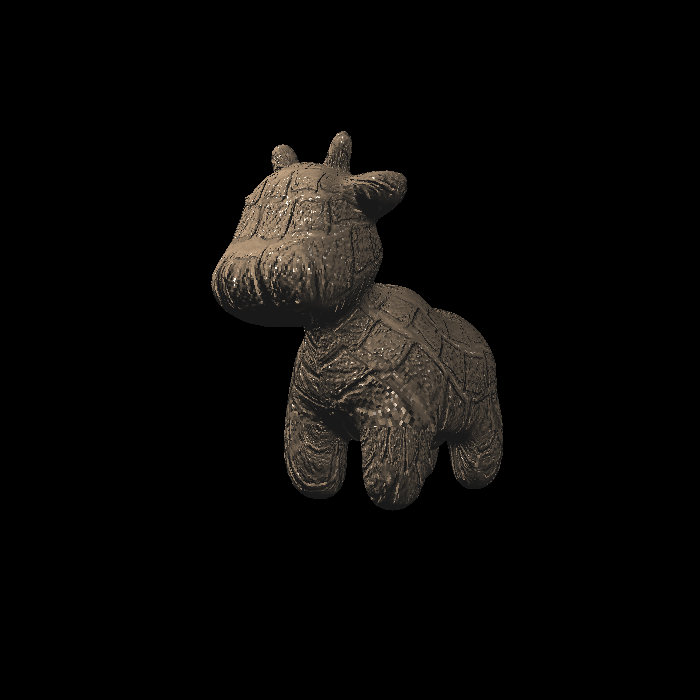
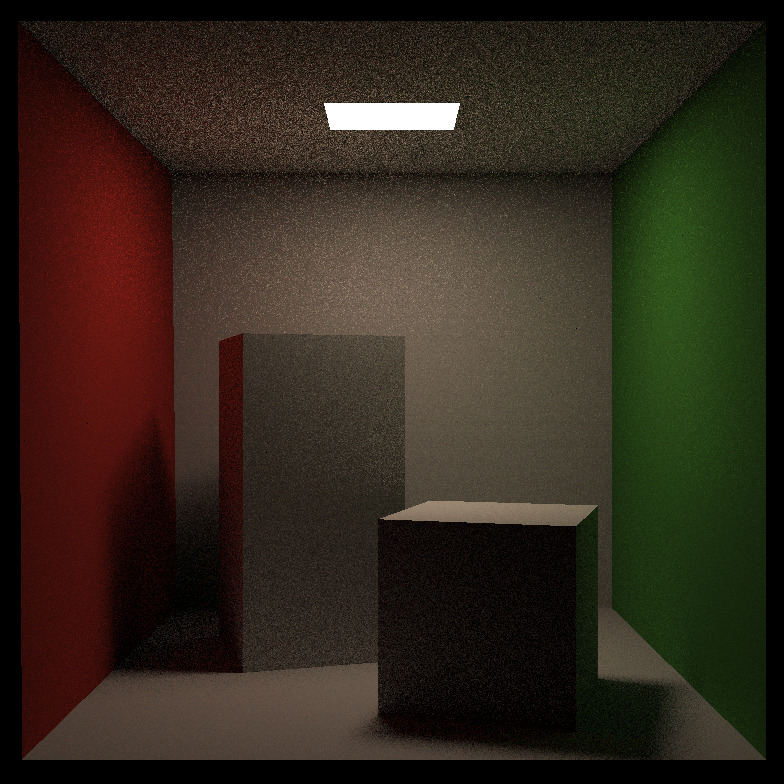

## About Me

I am a Master student at Institution for Interdisciplinary Information Science (IIIS), Tsinghua University. My advisor is Chenye Wu, who is advised by Andrew Chi-Chih Yao. Before entering IIIS, I am a bachelor in Department of Thermal Engineering. 

Researches for about both computer science and fulid and thermal transportation are my interests now. I hope I could participate in the interdisciplinary area for this two topics, like phyiscal simulation or physically based computer graphics. Certainly, I am still active for the privacy computing and mechanism design and welcome for communciation if we are interested in my work about these topic!

## Publications
### Privacy Computation in machine learning
- **Preserving in Non-Intrusive Load Monitoring: A Differential Privacy Perspective**
   
  **Haoxiang Wang**, Jiangsheng Zhang, Chenbei Lu, Chenye Wu
   
  **accepted** by IEEE Transactions on Smart Grid (IF=8.96).
   
  [[PDF](https://arxiv.org/pdf/2011.06205.pdf)] [[doi](https://ieeexplore.ieee.org/document/9261407)] 

- **Understanding Differential Privacy in Non-Intrusive Load Monitoring**
   
  **Haoxiang Wang**, Chenye Wu,
   
  **accepted** by e-Energy '20.
   
  [[pdf](./assets/eenergy.pdf)] [[doi](https://dl.acm.org/doi/10.1145/3396851.3403508)]

- **Differential Privacy in Consumer Behavior Analysis**
   
  **Haoxiang Wang**, Xun Luo, Chenye Wu,
   
  accepted by IEEE PES General Meeting 2021.
   
  [[PDF](./assets/Privacy_for_PES__Copy_.pdf)] [[Talk](https://youtu.be/WJ_vojAD7mw)]

- **Asynchronous Training Schemes in Distributed Learning with Time Delay**
   
  **Haoxiang Wang**, Zhanhong Jiang, Chao Liu
   
  under review for **NeurIPS 2021**.
   
  [[PDF](https://openreview.net/pdf?id=PSukBxwOSs)] 

- **Federated Learning with Classifier Shift for Class Imbalance**
   
  Yuheng Shen, **Haoxiang Wang**, Hairong Lv
   
  under review for **NeurIPS 2021**.
   
  [[PDF](https://openreview.net/pdf?id=6vNUZthdYf1)] 

### Mechanism Design and Pricing

- **Optimal Green Certificate Auction Considering Economic Dispatch**
   
  **Haoxiang Wang**, Chenye Wu
   
  Working Paper.'
  [[PDF](./assets/Green_certificates_auction__neurips_2021_.pdf)]

- **Vulnerability Analysis for Data Driven Pricing Schemes**
   
  Jingshi Cui, **Haoxiang Wang**, Chenye Wu
   
  **accepted** by IEEE PES General Meeting.
   
  [[PDF](https://arxiv.org/pdf/1911.07453.pdf)] [[doi](https://ieeexplore.ieee.org/document/9281848)] 
  
- **Robust Data-driven Profile-based Pricing Schemes**
   
  Jingshi Cui, **Haoxiang Wang**, Chenye Wu
   
  **accepted** by IEEE ISGT NA 2021.
   
  [[PDF](https://arxiv.org/pdf/1912.05731.pdf)] 

- **Bridging Chance-constrained and Robust Optimization in an Emission-aware Economic Dispatch with Energy Storage**
   
  Nan Gu, **Haoxiang Wang**, Jiangsheng Zhang, Chenye Wu
   
  under review by **IEEE transactions on power system** (**Top** for electrical engineering).
  
### Practical Application

- **Collaborative deep learning framework for fault diagnosis in distributed complex systems**
   
  **Haoxiang Wang**, Chao Liu, Dongxiang Jiang, Zhanhong Jiang
   
  **accepted** by Mechanical Systems and Signal Processing (IF=6.4).
   
  [[PDF](./assets/mssp.pdf)] [[doi](https://doi.org/10.1016/j.ymssp.2021.107650)] 

- **Thompson Sampling Based on Deep Representation**
   
  Yuhai Song, Lu Wang, HM D, Wang Zhe, **Haoxiang Wang**
   
  under review for **NeurIPS 2021**.
   
  [[PDF](https://openreview.net/pdf?id=SRE8sviET2g)] 

<!--
## Project
 - **Physical simluation for plasma ignition**
  
 Use OpenFOAM to conduct the simluation for plasma ignition. Constrcut a simple framework to simulation this phenomenon and try to find the insights for engineering.
 
<>
 

 - **Courses for GAMES 101 201 202**
  
 Learn the basic of the computer graphics, physically based animation and real-time rendering. 
<> 
<> 
<>
       
[[Code] ]
 

- **CCF&DIDI time and spatial prediction**
   
  Predict the roads' degree of crowdedness with the history time data and the spatial data of the road. We got the rank 13 for 200 competitors.
[[Code] ]
   
-->
## Project

<table style="width:100%; border: none;">
   <tr>
    <th>

</th>
    <th>
Physical simluation for plasma ignition

Use OpenFOAM to conduct the simluation for plasma ignition. Constrcut a simple framework to simulation this phenomenon and try to find the insights for engineering.<a href="https://github.com/qingxu-thu/plasma_ignite"> [code]
</a></th>
  </tr>
  <tr>
    <th>

</th>
    <th>
Normal mapping and Displacement mapping

Conduct basic texture mapping and normal mapping with simple soft rendering pipeline.<a href="https://github.com/qingxu-thu/Games-101-HW/tree/main/Assignment3"> [code]</a>
</th>
  </tr>
  <tr>
    <th>

</th>
    <th>
PCF and PCSS for soft shadow</a>

Conduct ray tracing with BVH acceleration for simple CornellBox.<a href="https://github.com/qingxu-thu/Games-101-HW/tree/main/PA7-1/PA7"> [code]
</a></th>
  </tr>
  <tr>
    <th>

</th>
    <th>
PCF and PCSS for soft shadow

Conduct PCF and PCSS compared with simple two pass shadow map and derive some sights for soft shadow.<a href="https://github.com/qingxu-thu/Games-202-HW/tree/main/hw1"> [code]
</a></th>
  </tr>
  <tr>
    <th>

</th>
    <th>
Precomputed Radiance Transfer

Conduct PCF and PCSS compared with simple two pass shadow map and derive some sights for soft shadow.<a href="https://github.com/qingxu-thu/Games-202-HW/tree/main/assignment2"> [code]
</a></th>
  </tr>
  <tr>
    <th>

</th>
    <th>
CCF&DIDI time and spatial prediction</a>

Predict the roads' degree of crowdedness with the history time data and the spatial data of the road. We got the rank 13 for 200 competitors.<a href="https://github.com/qingxu-thu/competition-preprocess-code"> [code]
</th>
  </tr>
</table>

 
## Awards and Honors
  - Academic Scholarship for Tsinghua University, Sept 2017,2018
  - Excellent graduate of Tsinghua University, Sept 2019
  
For more information, you could come to my CV [[PDF](./asset/cveg2.pdf)].
  
  
